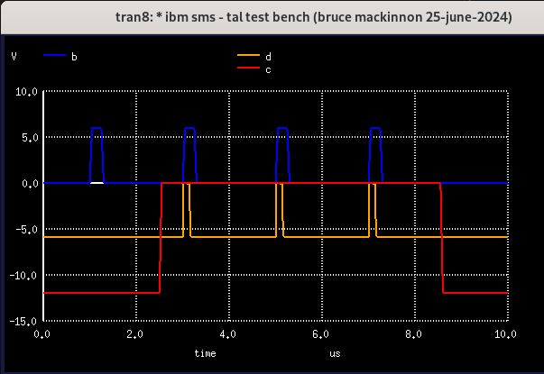

_(In-depth documentation of this interesting card for illustrative purposes.)_

[SMS Card Database Entry](https://static.righto.com/sms/TAL.html)

This card provides a monostable multivibrator (one-shot) circuit. 

Pin C is a gate with standard logic levels (down: 0 to -0.6v, down: -6v to -12v).

Pin B is the AC trigger.  A positive shift of 4.5v to 6v is required.

Pin D is the output. The normal (down) level is around -6 volts. The triggered (up) level is 0v to -0.5v.

SPICE simulation indicates a pulse width of approximately 0.16 microseconds.

Here's what the simulation looks like:

The red trace is the gate (pin C), the blue trace
is the AC trigger (pin B), and the orange trace is
the output (bin D).

